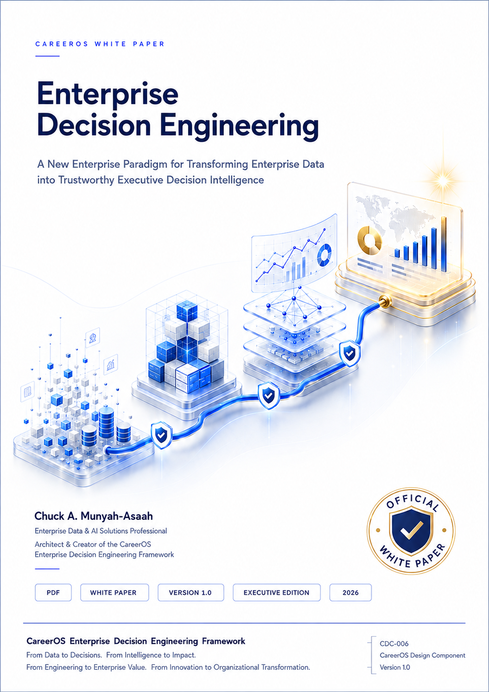

<div align="center">

# CareerOS Publications

## Official Digital Research Library

### CareerOS Enterprise Decision Engineering Framework (CEDEF)

*Advancing Enterprise Decision Engineering Through Research, Executive Publications, Applied Frameworks, and Reusable Enterprise Knowledge*

<br>



<br>

**CareerOS Executive White Paper Series**

Research • Executive Thought Leadership • Enterprise Engineering • Organizational Learning

</div>

---

# Welcome

**CareerOS Publications** is the official digital research library supporting the **CareerOS Enterprise Decision Engineering Framework (CEDEF).**

Its mission is to advance **Enterprise Decision Engineering** through executive white papers, research publications, applied frameworks, Signature Visuals, reference materials, and related intellectual assets that explore how organizations transform enterprise intelligence into trustworthy executive decisions, reusable organizational capability, and sustainable enterprise value.

CareerOS Publications provides a permanent digital home for the ideas, methodologies, frameworks, models, visual architectures, executive perspectives, and applied knowledge that define the emerging discipline of Enterprise Decision Engineering.

The publication program is designed for:

- executive leaders;
- enterprise architects;
- data, analytics, and AI professionals;
- decision intelligence practitioners;
- consultants;
- researchers;
- educators and students;
- transformation leaders;
- enterprise technology professionals;
- organizational decision-makers.

The library is being developed not simply as a collection of documents, but as a **structured and progressively accumulating body of enterprise knowledge**.

---

# CareerOS Executive White Paper Series

The **CareerOS Executive White Paper Series** develops the intellectual foundations and applied architecture of Enterprise Decision Engineering through a progressive sequence of executive research publications.

Each publication addresses a distinct enterprise engineering problem while contributing to a unified body of knowledge.

| Publication | Title | Version | Status |
|---|---|:---:|:---:|
| **[WP-001](wp-001/)** | **Enterprise Decision Engineering**<br>*Why Enterprise Intelligence Needs an Engineering Discipline* | **1.0** | ✅ Published |
| **[WP-002](wp-002/)** | **Decision Intelligence Engineering**<br>*Engineering the Bridge Between Enterprise Intelligence and Executive Decision-Making* | **1.0** | ✅ Published |
| **[WP-003](wp-003/)** | **Progressive Enterprise Asset Engineering**<br>*Engineering Reusable Enterprise Intelligence Assets for Continuous Organizational Learning and Decision Excellence* | **1.0** | ✅ **Published — Final Research Edition** |
| **WP-004** | **Executive Decision Engineering**<br>*Engineering Trustworthy Executive Decisions for Sustainable Enterprise Leadership* | **1.1** | 🚀 **Upcoming Release** |
| **WP-005** | **Enterprise Decision Operations**<br>*Operationalizing Enterprise Decision Engineering for Continuous Organizational Performance* | **1.1** | 🛠️ **In Development** |

---

# Current Publication

<div align="center">

## WP-003

# Progressive Enterprise Asset Engineering

### *Engineering Reusable Enterprise Intelligence Assets for Continuous Organizational Learning and Decision Excellence*

**Publication 3 • Final Research Edition • 2026**

</div>

Traditional projects conclude.

**Enterprise capability should not.**

WP-003 introduces **Progressive Enterprise Asset Engineering (PEAE)**—the CareerOS principle that enterprise initiatives should deliberately leave behind governed, reusable Enterprise Assets that strengthen future organizational intelligence, learning, decision quality, and enterprise capability.

Its central proposition is:

> **Every completed initiative should leave behind reusable enterprise assets that make future work faster, stronger, more informed, more governable, and more capable than the work that preceded it.**

WP-003 extends the inquiry established in WP-001 and WP-002:

```text
PROJECT EXPERIENCE
        ↓
ENTERPRISE ASSETS
        ↓
ORGANIZATIONAL MEMORY
        ↓
DECISION INTELLIGENCE
        ↓
STRONGER FUTURE DECISIONS
        ↓
STRONGER ENTERPRISE CAPABILITY
```

### 📘 Explore the Publication

➡️ **[Open the WP-003 Publication Page](wp-003/)**

The WP-003 publication package includes:

- Final Research Edition;
- Executive Edition;
- official publication cover;
- Progressive Enterprise Asset Engineering framework;
- Enterprise Asset Taxonomy;
- Enterprise Asset Lifecycle;
- Enterprise Asset Maturity Model;
- Enterprise Asset Governance Framework;
- Enterprise Capability Accumulation architecture;
- Enterprise Asset Certification Framework;
- Enterprise Knowledge Accumulation Model;
- Reusable Intelligence Asset Model;
- Enterprise Intelligence Ecosystem;
- Organizational Learning Continuum;
- citation information;
- supporting Signature Visuals.

---

# Previously Published

## WP-002 — Decision Intelligence Engineering

### *Engineering the Bridge Between Enterprise Intelligence and Executive Decision-Making*

**Publication 2 • Version 1.0 • 2026**

Decision Intelligence Engineering addresses the critical space between what an enterprise knows and what its leaders ultimately decide to do.

It establishes a disciplined engineering approach for transforming governed enterprise intelligence into explainable choices, accountable executive commitments, measurable outcomes, and organizational learning.

➡️ **[Open the WP-002 Publication Page](wp-002/)**

---

## WP-001 — Enterprise Decision Engineering

### *Why Enterprise Intelligence Needs an Engineering Discipline*

**Publication 1 • Version 1.0 • 2026**

WP-001 establishes the foundational proposition of the CareerOS publication program:

> **Enterprise intelligence requires an engineering discipline capable of systematically transforming data, analytics, Business Intelligence, Artificial Intelligence, and organizational knowledge into trustworthy executive decision intelligence.**

➡️ **[Open the WP-001 Publication Page](wp-001/)**

---

# Upcoming Publication

<div align="center">

## WP-004

# Executive Decision Engineering

### *Engineering Trustworthy Executive Decisions for Sustainable Enterprise Leadership*

**Publication 4 • Version 1.1 • 2026**

</div>

WP-004 moves the CareerOS inquiry directly into the engineering of consequential executive decisions.

Its central concern is:

> **How can organizations deliberately engineer the conditions under which trustworthy, accountable, explainable, governable, and learnable executive decisions are made?**

The publication develops an integrated architecture connecting:

```text
STRATEGIC TRIGGER
        ↓
DECISION FRAMING
        ↓
EVIDENCE & CONTEXT
        ↓
ALTERNATIVE ENGINEERING
        ↓
RISK, UNCERTAINTY & TRADE-OFFS
        ↓
GOVERNANCE, ETHICS & CONSTRAINTS
        ↓
EXECUTIVE JUDGMENT
        ↓
ACCOUNTABLE DECISION
        ↓
ORGANIZATIONAL COMMITMENT
        ↓
EXECUTION
        ↓
OUTCOME EVALUATION
        ↓
EXECUTIVE LEARNING
        ↓
DECISION ASSET
        ↺
```

WP-004 is supported by the SV-025–SV-030 Signature Visual architecture covering:

- Executive Decision Engineering Lifecycle;
- Executive Decision Trust Framework;
- Recommendation-to-Outcome Chain;
- Executive Judgment Environment;
- Decision Authority & Accountability Model;
- Executive Decision Learning Loop.

**Public launch scheduled for October 2026.**

---

# In Development

## WP-005 — Enterprise Decision Operations

### *Operationalizing Enterprise Decision Engineering for Continuous Organizational Performance*

WP-005 extends Enterprise Decision Engineering from individual consequential decisions into a continuous organizational operating capability.

Its governing question is:

> **How can consequential decision-making operate continuously across the enterprise while preserving visibility, governance, legitimate authority, accountability, execution, learning, and responsible AI use?**

Its emerging operating architecture includes:

```text
SENSE
   ↓
PRIORITIZE
   ↓
ENGINEER
   ↓
DECIDE
   ↓
EXECUTE
   ↓
LEARN
   ↺
```

WP-005 develops:

- Enterprise Decision Operations;
- Enterprise Decision Portfolio Management;
- Decision Operations Control Plane;
- Enterprise Decision State Management;
- Decision Operations Command Center;
- Enterprise Decision Operations Maturity.

---

# Publication Journey

The **CareerOS Executive White Paper Series** follows a deliberate intellectual progression.

## WP-001 — Establish the Discipline

**Enterprise Decision Engineering**

*Why does Enterprise Intelligence require an engineering discipline?*

↓

## WP-002 — Engineer the Bridge

**Decision Intelligence Engineering**

*How does governed enterprise intelligence become trustworthy executive action?*

↓

## WP-003 — Preserve and Compound Capability

**Progressive Enterprise Asset Engineering**

*How can every completed initiative permanently strengthen the enterprise?*

↓

## WP-004 — Engineer Executive Commitment

**Executive Decision Engineering**

*How can consequential executive decisions become trustworthy, accountable, traceable, and learnable?*

↓

## WP-005 — Operationalize the Enterprise

**Enterprise Decision Operations**

*How can consequential decision-making operate as a continuous, governed, observable, accountable, and learning-centered enterprise capability?*

↓

## Beyond the White Papers

The research architecture progressively expands from theory into:

**Practice → Application → Evidence → Standardization → Implementation**

---

# CareerOS Knowledge Progression

The publication program increasingly reveals a broader enterprise knowledge architecture:

```text
ENTERPRISE DATA
      ↓
DATA INTEGRATION & ENGINEERING
      ↓
GOVERNED INTELLIGENCE
      ↓
DECISION INTELLIGENCE
      ↓
EXECUTIVE DECISION ENGINEERING
      ↓
ENTERPRISE DECISION OPERATIONS
      ↓
OUTCOMES & EVIDENCE
      ↓
ORGANIZATIONAL LEARNING
      ↓
REUSABLE ENTERPRISE ASSETS
      ↓
STRONGER FUTURE DECISIONS
      ↓
SUSTAINABLE ENTERPRISE VALUE
      ↺
```

This progression expresses a central CareerOS principle:

> **Enterprise intelligence should accumulate rather than disappear.**

---

# Publication Architecture

CareerOS Publications is being developed as more than a collection of downloadable documents.

Each publication progressively contributes to a structured **Digital Research Library**.

A mature publication package may contain:

- Final Research Edition;
- Executive Edition;
- Official Publication Cover;
- Signature Visuals;
- Executive Frameworks;
- Assessment Models;
- Executive Canvases;
- Implementation Guides;
- Release Notes;
- Citation Information;
- Supporting Research Assets.

The public PDF editions serve as fixed publication artifacts.

Editable development files are maintained separately as controlled working assets.

---

# CareerOS Publication Families

The **CareerOS Digital Research Library** is designed to support multiple complementary publication families as the ecosystem matures.

## 📄 Executive White Papers — WP-XXX

Strategic research publications developing the theory, architecture, and practice of Enterprise Decision Engineering.

**Primary function:** establish and extend the intellectual framework.

---

## 📘 Executive Practice Guides — PG-XXX

Implementation-oriented publications translating CareerOS research into practical organizational methods, procedures, playbooks, templates, and executive instruments.

**Primary function:** turn theory into repeatable practice.

---

## 🧭 Executive Case Studies — CS-XXX

Worked organizational scenarios demonstrating how Enterprise Decision Engineering operates in realistic enterprise contexts.

**Primary function:** demonstrate application and generate practice-based evidence.

---

## 📐 Reference Standards — RS-XXX

Formal engineering requirements, governance models, assessment criteria, assurance mechanisms, implementation specifications, and certification structures supporting CEDEF.

**Primary function:** convert mature framework concepts into explicit reference requirements.

---

## 🏗️ Technical Architecture — TA-XXX

Technical specifications describing systems, data architecture, AI architecture, APIs, integration patterns, controls, and implementation designs supporting Enterprise Decision Engineering.

**Primary function:** translate enterprise concepts into buildable technical architecture.

---

## 🧪 Research Notes — RN-XXX

Focused investigations extending emerging theoretical, analytical, technical, organizational, and empirical questions within Enterprise Decision Engineering.

**Primary function:** investigate new questions before full formalization.

---

## 📰 Executive Field Briefs — FB-XXX

Concise executive publications addressing timely enterprise decision, data, analytics, AI, governance, and organizational capability issues.

**Primary function:** provide focused executive guidance.

---

## 🏗 Reference Implementations

Applied enterprise implementations demonstrating how CareerOS principles operate in realistic organizational and technical scenarios.

**Primary function:** demonstrate executable implementations of the framework.

---

# From Research to Enterprise Practice

The expanding CareerOS publication architecture follows a deliberate knowledge-development lifecycle:

```text
WP — THINK
Establish the intellectual architecture
        ↓
PG — APPLY
Translate theory into organizational practice
        ↓
CS — DEMONSTRATE
Show the framework operating in realistic contexts
        ↓
RS — STANDARDIZE
Define requirements, controls, and assurance criteria
        ↓
TA — BUILD
Specify implementation and technical architecture
        ↓
EVIDENCE & LEARNING
Observe what works
        ↓
FRAMEWORK EVOLUTION
Strengthen future CareerOS research
        ↺
```

In condensed form:

> **Research → Practice → Application → Evidence → Standardization → Implementation → Learning**

---

# Related CareerOS Resources

CareerOS Publications operates within a broader enterprise engineering ecosystem.

## 🏠 Executive Portal

Meet the architect, explore the professional vision, and navigate the CareerOS ecosystem.

➡️ **[CareerOS Executive Portal](https://github.com/camunyah)**

---

## 📘 Framework Portal

The official home of the **CareerOS Enterprise Decision Engineering Framework (CEDEF).**

Explore the framework philosophy, architecture, Signature Visuals, Preview Edition, and continuing development of Enterprise Decision Engineering.

➡️ **CareerOS Enterprise Decision Engineering Framework**

---

## 🛍️ Reference Implementation Portal

Experience Enterprise Decision Engineering through practical enterprise implementations.

The official retail Reference Implementation demonstrates how enterprise data can be transformed into demand forecasting, inventory optimization, Decision Intelligence, executive reporting, and decision support.

➡️ **AI-Driven Demand Forecasting & Inventory Optimization**

---

# CareerOS Ecosystem

CareerOS connects complementary professional, research, framework, publication, and implementation environments.

| Portal | Purpose |
|---|---|
| 🏠 **Executive Portal** | Meet the architect and explore the CareerOS professional vision |
| 📘 **Framework Portal** | Understand the CareerOS Enterprise Decision Engineering Framework |
| 🛍️ **Reference Implementation Portal** | Experience Enterprise Decision Engineering through practical implementations |
| 📄 **CareerOS Publications** | Explore the official CareerOS Digital Research Library |

Together, these environments connect:

> **Professional Leadership → Enterprise Architecture → Research → Publication → Applied Implementation → Organizational Learning**

into a unified CareerOS ecosystem.

---

# Citation & Responsible Use

CareerOS publications are intended to support:

- professional learning;
- executive education;
- enterprise research;
- academic discussion;
- responsible organizational application.

When referencing CareerOS publications, readers are encouraged to identify:

- Author
- Publication title
- Publication identifier
- Edition
- Version
- CareerOS Publications
- Publication year

Individual publication pages provide or progressively introduce publication-specific citation information.

---

# About CareerOS

**CareerOS** is an enterprise engineering ecosystem dedicated to advancing the theory and practice of **Enterprise Decision Engineering**.

It integrates:

- enterprise frameworks;
- Executive White Papers;
- Practice Guides;
- Reference Standards;
- Case Studies;
- Research;
- Signature Visuals;
- Reference Implementations;
- intelligent software;
- executive education;
- certification;
- consulting.

Its central objective is to help organizations transform enterprise intelligence into trustworthy executive decisions, reusable organizational capability, continuous learning, and sustainable enterprise value.

---

# About the Architect

**Chuck A. Munyah-Asaah** is an Enterprise Data, AI & Decision Intelligence professional whose experience spans Enterprise Information Systems, Healthcare Information Systems, National Health Information Systems, Business Intelligence, Enterprise Reporting, Organizational Decision Support, Digital Transformation, and Enterprise Analytics.

He is the architect and creator of the **CareerOS Enterprise Decision Engineering Framework (CEDEF)** and develops its publications, methodologies, frameworks, Signature Visuals, and Reference Implementations.

---

<div align="center">

# CareerOS Publications

## Enterprise Decision Engineering™

**Engineering Better Decisions. Building Stronger Enterprises.**

<br>

### CareerOS Digital Research Library

**Executive White Papers • Practice Guides • Case Studies • Reference Standards • Technical Architecture • Research Notes • Executive Field Briefs • Reference Implementations**

<br>

**Version 1.1 • 2026**

© 2026 Chuck A. Munyah-Asaah

</div>
