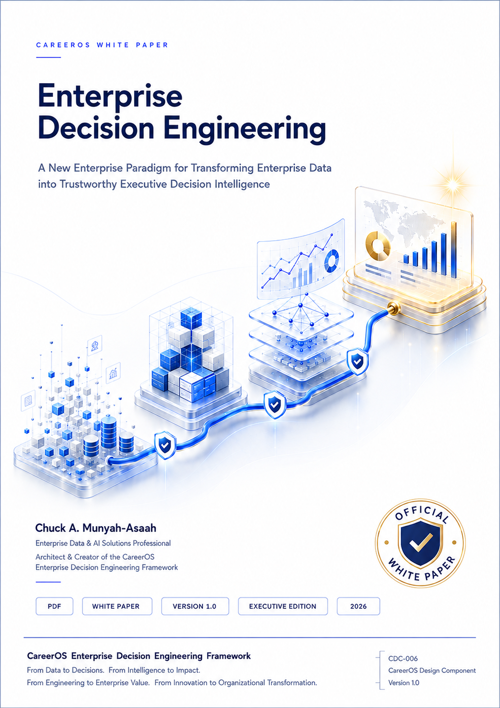

# WP-001

# Enterprise Decision Engineering

## *Why Enterprise Intelligence Needs an Engineering Discipline*

**CareerOS Executive White Paper**

**Version 1.0**

2026

---

# 📄 Download

## Executive White Paper (PDF)

➡️ **[Download WP-001 – Enterprise Decision Engineering](WP-001-Enterprise-Decision-Engineering.pdf)**

---

# About this Publication

**WP-001 – Enterprise Decision Engineering** is the inaugural **CareerOS Executive White Paper**.

It introduces **Enterprise Decision Engineering** as a new enterprise engineering discipline dedicated to transforming enterprise intelligence into trustworthy executive decision intelligence.

Written for executive leaders, enterprise architects, consultants, researchers, educators, and organizational decision-makers, the publication examines why Enterprise Intelligence now requires a disciplined engineering approach and presents the foundational philosophy behind the **CareerOS Enterprise Decision Engineering Framework (CEDEF).**

The complete publication is available through the downloadable PDF above.

---

# Publication Information

| Attribute | Value |
|-----------|-------|
| **Publication ID** | WP-001 |
| **Publication Family** | CareerOS Executive White Papers |
| **Publication Title** | Enterprise Decision Engineering |
| **Subtitle** | *Why Enterprise Intelligence Needs an Engineering Discipline* |
| **Version** | 1.0 |
| **Publication Year** | 2026 |
| **Author** | Chuck A. Munyah-Asaah |
| **Publisher** | CareerOS Publications |
| **Status** | ✅ Official Release |

---

# Related Publications

### 📘 Framework Portal

Explore the official **CareerOS Enterprise Decision Engineering Framework (CEDEF)**, including its philosophy, architecture, Signature Visuals, Preview Edition (PE-001), and the continuing development of Enterprise Decision Engineering.

➡️ **[CareerOS Enterprise Decision Engineering Framework](https://github.com/camunyah/careeros-enterprise-decision-engineering-framework)**

---

### 📖 Preview Edition (PE-001)

**PE-001 — CareerOS Enterprise Decision Engineering Framework**

Official Markdown publication introducing the philosophy, architecture, and vision of Enterprise Decision Engineering.

Available through the Framework Portal.

---

### 📚 Reference Standards

Reference Standards define the engineering methodologies, governance models, implementation guidance, certification procedures, and engineering specifications supporting Enterprise Decision Engineering.

**RS-001 — CareerOS Enterprise Decision Engineering Framework Reference Standard** is currently in development and will be published through the Framework Portal.

---

# CareerOS Enterprise Decision Engineering Philosophy

> **From Data to Decisions.**
>
> **From Intelligence to Impact.**
>
> **From Engineering to Enterprise Value.**
>
> **From Innovation to Organizational Transformation.**

---

### CareerOS Publications

**Official Executive White Paper**

**WP-001**

Version 1.0

